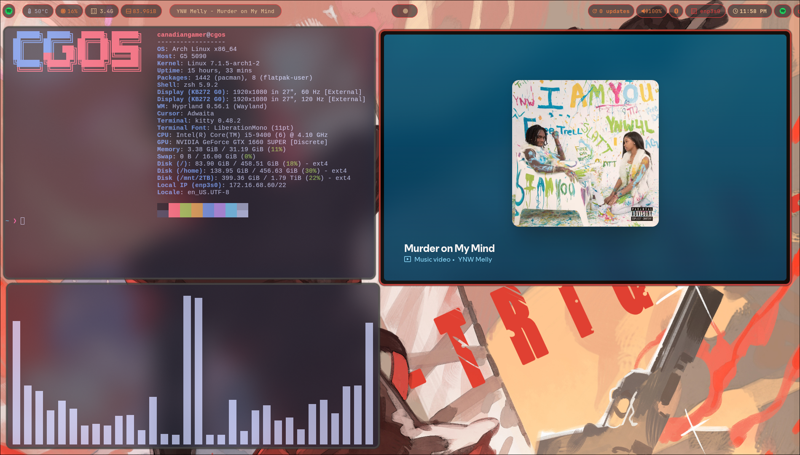
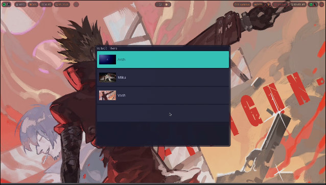
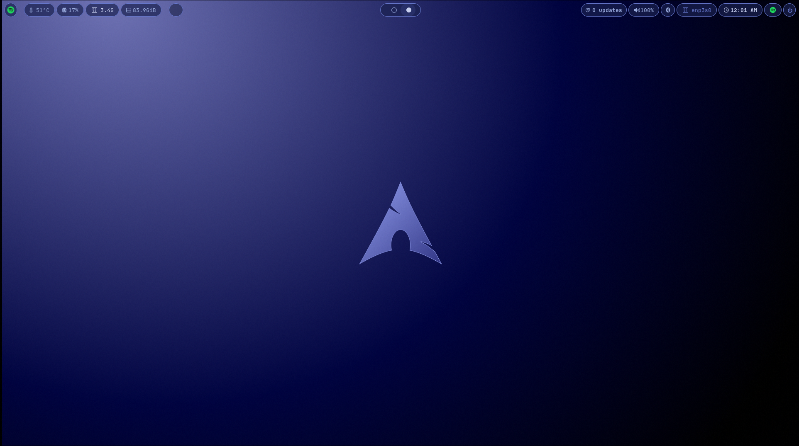
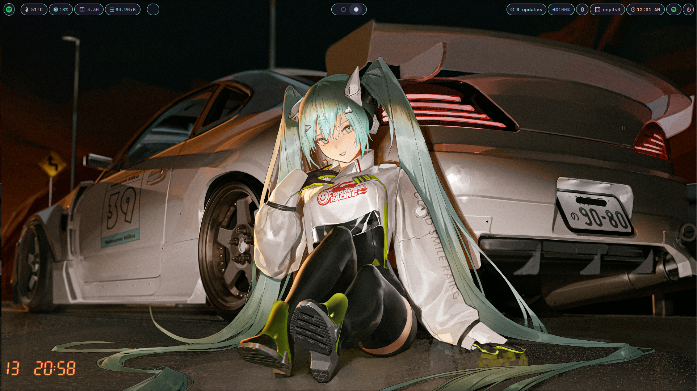
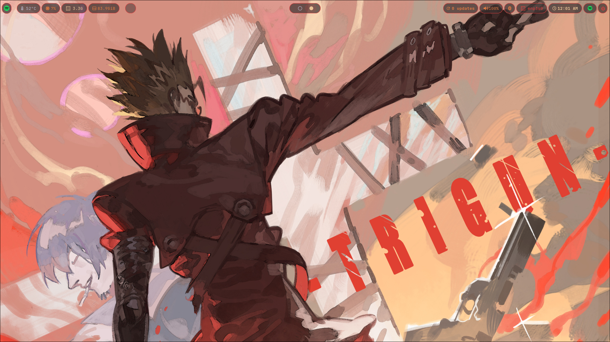

# DOTFILES

My riced Hyprland + Arch Linux configuration.

## Demo

[](https://www.youtube.com/watch?v=EckhSjf67jQ)

## Screenshots

| | |
|---|---|
|  |  |
| Waybar + fastfetch + cava | Theme switcher (`Super + W`) |

---

## What's Included

| Config | Description |
|--------|-------------|
| `hypr` | Hyprland, keybinds, autostart, scripts |
| `waybar` | Status bar with custom warm red/orange theme |
| `rofi` | App launcher + screenshot theme |
| `kitty` | Terminal |
| `cava` | Audio visualizer |
| `wlogout` | a logout screen for wayland |
| `Termsonic` | a TUI for any sonic api music servers|
| `nvim` | A tui text editor with a lazyvim plugins|
| `hyprpolkitagent`|a polkit agent for hyprland |
| `slurp, grim, jq`| used for screenshot |
### Themes

Themes live in `./themes/` and are applied via the rofi theme-switcher (`Super + w`).
Each theme includes a wallpaper, waybar style, and Hyprland border colors.

| Theme | Preview |
|-------|---------|
| Arch |  |
| Miku |  |
| Vash |  |

---

## Keybinds

Defined in [`hypr/binds.lua`](.config/hypr/binds.lua). `mainMod` is set to `SUPER` (the Windows key).

| Keybind | Action |
|---|---|
| `Super + Q` | Open terminal (`kitty`) |
| `Super + E` | Open file manager (`dolphin`) |
| `Super + F` | Open browser (`firefox`) |
| `Super + H` | Open Helium browser |
| `Super + R` | Open app launcher (`rofi`) |
| `Super + W` | Open the theme switcher |
| `Super + C` | Close the active window |
| `Super + M` | Exit Hyprland |
| `Super + V` | Toggle floating on the active window |
| `Super + P` | Toggle pseudotiling (dwindle layout) |
| `Super + J` | Toggle split orientation (`rotatesplit`) |
| `Super + N` | Kill Nextcloud |
| `Super + S` | Toggle the special workspace (scratchpad) |
| `Super + Shift + S` | Open the screenshot menu (fullscreen / region / window) |
| `Super` + ←/→/↑/↓ | Move focus between windows |
| `Super` + `0`-`9` | Switch to workspace `1`-`10` |
| `Super + Shift` + `0`-`9` | Move the active window to workspace `1`-`10` |
| `Super` + scroll wheel | Cycle through existing workspaces |
| `Super` + left-click drag | Move the active window |
| `Super` + right-click drag | Resize the active window |
| Volume up/down/mute keys | Adjust or mute output volume |
| Mic mute key | Toggle microphone mute |
| Brightness up/down keys | Adjust screen brightness |
| Media play/pause/next/prev keys | Control media playback (`playerctl`) |

---

## Configuration — what to edit

| Want to change... | Edit this file |
|---|---|
| Keybinds | [`.config/hypr/binds.lua`](.config/hypr/binds.lua) — add new binds with `hl.bind(mainMod .. " + KEY", hl.dsp....)` |
| Default apps (terminal, browser, file manager, launcher) | [`.config/hypr/programs.lua`](.config/hypr/programs.lua) |
| Monitor layout / resolution / refresh rate | [`.config/hypr/monitors.lua`](.config/hypr/monitors.lua) via `hl.monitor()` |
| Autostart apps, animations, layout, input, env vars | [`.config/hypr/hyprland.lua`](.config/hypr/hyprland.lua) |
| Waybar modules/appearance | `.config/waybar/` |
| Rofi launcher/screenshot styling | `.config/rofi/` |
| Terminal appearance | `.config/kitty/` |
| Audio visualizer | `.config/cava/` |
| Notifications | `.config/dunst/` |
| Logout screen | `.config/wlogout/` |
| Neovim | `.config/nvim/` |
| Add/edit a theme (wallpaper + waybar colors + border color) | `themes/<Name>/` — needs `wallpaper.png`, `theme.sh`, and an optional `preview.png`; picked up automatically by the `Super + W` switcher |

Config is written in Hyprland's native Lua format (not the old `.conf`/`hyprlang` syntax). After editing any `.lua` file, apply changes without restarting:

```bash
hyprctl reload
```

---

## Installation

### Automatic (recommended)

```bash
git clone https://github.com/EasyCanadianGamer/CG-Hyprland-Dotfiles.git
cd CG-Hyprland-Dotfiles
./install.sh
```

The script will:
- Check for Arch Linux and Hyprland
- Install required packages via `pacman` and `yay`
- Copy configs to `~/.config/`
- Copy themes to `~/.local/share/themes/`
- Set Arch as the default wallpaper theme

### Manual

1. Install packages:
```bash
sudo pacman -S --needed hyprland wayland awww cava kitty waybar rofi dunst pwvucontrol
yay -S --needed wlogout
```

2. Copy configs:
```bash
cp -r .config/. ~/.config/
cp -r themes/. ~/.local/share/themes/
```

3. Set a default wallpaper:
```bash
echo "$HOME/.local/share/themes/Arch/wallpaper.png" > ~/.cache/current-wallpaper
```

---

## Post-Install

- **SDDM theme** must be installed manually: [sddm-astronaut-theme](https://github.com/Keyitdev/sddm-astronaut-theme)
- Log out and back in (or reboot) after installing
